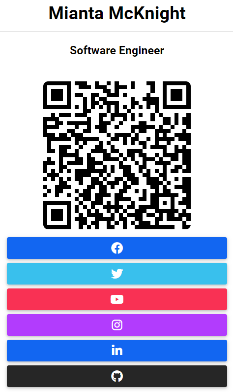

# Look Me Up QR Code (Collaborative Project)
 An professional user friendly networking QR Code application

## Table of Contents
 - [Description](#description)
 - [Motivation-for-Development](#motivation-for-development) 
 - [User-Story](#user-story)
 - [Technology-used](#technology-used)
 - [Sneak-Peek](#seak-peek)
 - [Usage](#usage)
 - [Links](#links)
 - [Collaborators-Credits](collaborators-credits)
 - [Built-with](#built-with)

## Description
**Look Me Up** is RESTful API QR Code Resume application, that allows the user to have someone scan the QR code it takes them to the social media profile on FaceBook, Instagram, LinkDin, GitHub and Twitter. This works across all devices and is convenient for people to network and share their information with others.

## Motivation for Development
We were thinking of ways to circulate our information without having to constantly carry business cards with us all the time. We believe that the **Look Me Up** App is not only cost effective, but environmentally friendly as well. Who doesn't want that?

## User Story
As A professional seeking to grow my business.
I WANT to quickly circulate my social media profiles when I am at conventions, conferences and out and about
SO THAT I can network but also gain potential clientele and share Social Media accounts and never miss the opportunity to connect with a new friend, colleague, or follower.

## Technology Used
*MDBootstrap, mySQL, Heroku, Sequelize ORM, Handlebars.js, Node.js, and Express.js*.  

## Sneak-Peek

  
Click to Reveal

 
[Look me up](https://look-meup.herokuapp.com/)

[Presentation](https://docs.google.com/presentation/d/1wnNs3TorkcW_KLNyfvWZWyUmkLxMF4LJoKHv___ewFY/edit#slide=id.g29f43f0a72_0_10)

## Screenshot 

## Demo
https://drive.google.com/file/d/1JAbSn4qHI_mlqyEKC6uV6MBYGmU0eAEH/view

## Usage
- Create an account on **Look Me Up** on the homepage then click    register
- create your profile and then fill out fields
- Click update 
- If ther are changes you would like to make go back to the dashboard and provide information you want to update 
- click update
- TA-DAH!!! There is your QR code that takes you to your soical media profiles
- If you want to delete it just go back to dashboard and click *delete* button.
## Links
- [Github](https://github.com/RogueStorm7/Look-Me-Up-QR-Code.git)
- [Heroku](https://look-meup.herokuapp.com/)

## Collaborators-Credits
- Mianta McKnight &mdash; [github.com/RogueStorm7](https://github.com/RogueStorm7)
- Abdurraouf Sadi &mdash; [github.com/asadi80](https://github.com/asadi80)
- Alex Marten &mdash; [github.com/alex-d-marten](https://github.com/alex-d-marten)
- Curtis Hong &mdash; [github.com/NonchalantGarage](https://github.com/NonchalantGarage) 
- Dan Doherty &mdash; [github.com/ddoherty6](https://github.com/ddoherty6)
- Eiko Ujifusa &mdash;[https://github.com/eikouji](https://github.com/eikouji) 
- Tina Sieben &mdash; [github.com/tinasieben](https://github.com/tinasieben)

## Built with:
*Node.js*

*Express.js*

*Heroku*

*mySQ*

*Sequelize*

*bCrypt*

*Mdbootstrap*

*Handlebars.js*

*QRCode.js*

&copy; 2022 Curtis Hong, Mianta McKnight, Alex Marten, Tina Sieben, Abdurraouf Sadi, Eiko Ujifusa, Dan Doherty  || All Rights Reserved
